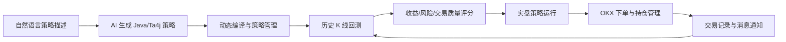
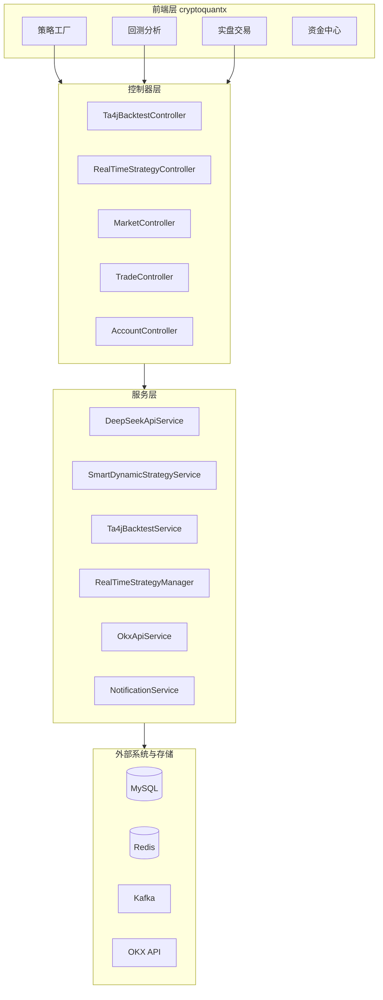

# OKX Trading

> AI 驱动的加密货币量化交易闭环平台：从自然语言生成策略，到 Ta4j 回测评分，再到 OKX 实盘执行、交易提醒和结果复盘。

[](https://www.oracle.com/java/)
[](https://spring.io/projects/spring-boot)
[](https://ta4j.github.io/ta4j-wiki/)
[](LICENSE)

OKX Trading 是一个面向个人量化研究和自动化交易实验的 Java Spring Boot 后端项目，配合 [cryptoquantx](https://github.com/ralph-wren/cryptoquantx) 前端使用。它把策略生成、历史回测、风险评分、实盘运行、订单记录和消息通知串成一条完整链路，适合快速验证加密货币交易策略的工程可行性。

> 风险提示：本项目仅用于技术研究、策略回测和自动化交易系统学习，不构成任何投资建议。加密资产价格波动剧烈，实盘交易可能造成本金损失；请先使用模拟环境和小资金验证，并自行承担风险。


## 为什么值得关注

- **自然语言生成策略**：通过 DeepSeek API 将策略描述生成 Java/Ta4j 策略代码，并支持动态编译、加载和热更新。
- **回测到实盘闭环**：同一套策略可以先跑历史回测、指标评分，再配置到 OKX 实盘策略执行引擎。
- **内置 250+ 策略与 33 个风险指标**：覆盖均线、振荡器、趋势、波动率、成交量、K 线形态、统计函数、组合策略和高级策略。
- **工程化落地完整**：集成 OKX REST/WebSocket、MySQL、Redis、Kafka、Docker、Swagger、多渠道通知和部署脚本。

## 功能闭环



## 核心模块

| 模块 | 说明 |
| --- | --- |
| 策略工厂 | 内置 250+ 策略，覆盖经典技术指标、组合策略、高级策略和机器学习启发策略。 |
| AI 策略生成 | 支持自然语言生成 Ta4j 策略代码，使用 Janino / Java Compiler API 动态编译加载。 |
| 回测分析 | 基于 Ta4j 0.18 执行单策略、批量、多线程回测，保存交易明细和回测摘要。 |
| 风险评分 | 计算最大回撤、夏普、Sortino、Calmar、VaR、CVaR、偏度、峰度等 33 个风险指标。 |
| 实盘交易 | 通过 OKX REST/WebSocket 获取行情、订阅 K 线、执行订单，支持现货和合约场景。 |
| 通知监控 | 支持邮件、Server 酱、企业微信等交易提醒和异常告警，配合日志定位运行状态。 |
| 数据管道 | MySQL 持久化策略、K 线、回测结果和订单；Redis 缓存行情；Kafka 可作为 K 线缓冲层。 |

## Demo 截图

| 实盘运行 | AI 生成策略 |
| --- | --- |
|  |  |

| 策略库 | 风险指标 |
| --- | --- |
|  |  |

| 回测指标 | 交易记录 |
| --- | --- |
|  |  |

## 技术栈

- **后端**：Java 21、Spring Boot 3.2.5、Maven
- **技术分析与回测**：Ta4j 0.18
- **动态策略**：DeepSeek API、Janino、Java Compiler API、Eclipse ECJ
- **交易与行情**：OKX REST API、OKX WebSocket、OkHttp、Java-WebSocket
- **存储与缓存**：MySQL 8、Redis、Spring Data JPA
- **消息与监控**：Kafka、Spring Kafka、邮件、Server 酱、企业微信
- **工程化**：Docker、Docker Compose、Swagger / springdoc-openapi
- **前端**：[cryptoquantx](https://github.com/ralph-wren/cryptoquantx)

## 快速开始

### 环境要求

- Java 21+
- Maven 3.6+
- MySQL 8.0+
- Redis 6.0+
- Docker / Docker Compose（可选）

### 1. 克隆项目

```bash
git clone https://github.com/ralph-wren/okx-trading.git
cd okx-trading
```

### 2. 配置环境变量

最小本地启动需要 MySQL 和 Redis。OKX、DeepSeek、通知渠道可以按需配置；不配置 OKX 密钥时，请先以回测和接口调试为主。

```bash
export MYSQL_USERNAME=root
export MYSQL_PASSWORD='your_mysql_password'
export OKX_API_KEY=''
export OKX_SECRET_KEY=''
export OKX_PASSPHRASE=''
export DEEPSEEK_API_KEY=''
```

Windows PowerShell 示例：

```powershell
$env:MYSQL_USERNAME="root"
$env:MYSQL_PASSWORD="your_mysql_password"
$env:OKX_API_KEY=""
$env:OKX_SECRET_KEY=""
$env:OKX_PASSPHRASE=""
$env:DEEPSEEK_API_KEY=""
```

### 3. 准备数据库

```bash
mysql -u root -p -e "CREATE DATABASE IF NOT EXISTS okx_trading DEFAULT CHARACTER SET utf8mb4 COLLATE utf8mb4_unicode_ci;"
mysql -u root -p okx_trading < src/main/resources/schema.sql
```

如果使用 Docker 管理依赖，可以参考 `docker/mysql/init/init.sql` 和 `scripts/` 下的部署脚本。

### 4. 启动后端

```bash
mvn spring-boot:run
```

启动后访问：

- Swagger API 文档：http://localhost:8088/swagger-ui.html
- OpenAPI JSON：http://localhost:8088/api-docs
- 健康检查：http://localhost:8088/actuator/health

### 5. Docker 部署

当前 `docker-compose.yml` 默认连接宿主机 MySQL 和 Redis：

```bash
mvn -DskipTests package
docker compose up -d --build
docker compose logs -f app
```

如果希望 MySQL / Redis 也由 Docker 启动，可以打开 `docker-compose.yml` 中已注释的 `mysql` 和 `redis` 服务。

## 常用接口

## 新手教程

- [从 AI 生成策略到回测：新手操作指南](docs/003-20260527-ai-strategy-backtest-workflow.md)

这份教程适合第一次使用本项目的人：先填写策略参数，再让 AI 生成 Java/Ta4j 策略代码，最后通过回测接口验证收益、最大回撤、手续费、滑点和爆仓风险。

### 策略与 AI 生成

```bash
curl -X POST "http://localhost:8088/api/backtest/ta4j/generate-strategy" \
  -H "Content-Type: application/json" \
  -d '"生成类似 ATR 的策略"'
```

### 单策略回测

```bash
curl -X POST "http://localhost:8088/api/backtest/ta4j/run?endTime=2025-01-01%2000%3A00%3A00&initialAmount=10000&interval=1D&saveResult=true&startTime=2024-01-01%2000%3A00%3A00&strategyType=SMA&symbol=BTC-USDT"
```

### 批量回测

```bash
curl -X POST "http://localhost:8088/api/backtest/ta4j/run-all?startTime=2024-01-01%2000%3A00%3A00&endTime=2024-12-01%2000%3A00%3A00&initialAmount=10000&symbol=BTC-USDT&interval=1D&saveResult=true&feeRatio=0.001"
```

## 系统架构

详细架构请查看 [ARCHITECTURE.md](ARCHITECTURE.md)。核心调用关系如下：



## 路线图

- [ ] 完善一键 Docker Compose：后端、MySQL、Redis、Kafka 全链路默认可启动。
- [ ] 增加在线 Demo / 演示视频，降低首次理解成本。
- [ ] 补充更多回测样例数据和策略对比报告。
- [ ] 增加 CI，自动运行编译、单元测试和 README 链接检查。
- [ ] 扩展多交易所适配层，沉淀统一行情和订单接口。
- [ ] 强化实盘安全：模拟盘模式、订单限额、熔断、密钥加密和审计日志。

## 开源可信度与使用边界

- 项目当前偏个人研究和工程实验，建议先阅读 [ARCHITECTURE.md](ARCHITECTURE.md)、`docs/` 和 `scripts/README.md`。
- 实盘交易前务必检查 API Key 权限、代理、账户余额、订单类型、最小下单量、费率和风控参数。
- 不建议直接把 AI 生成策略用于实盘。推荐流程：生成策略 -> 编译检查 -> 历史回测 -> 多周期验证 -> 小资金试运行 -> 持续监控。
- 本项目不保证策略收益，不对任何交易损失负责。

## 贡献指南

欢迎提交 Issue 和 PR。建议优先贡献：

- 可复现的 Bug 报告和日志片段
- 新策略、新指标或回测样例
- Docker / 部署体验改进
- README、架构文档、教程和截图补充
- 测试用例、CI 和安全加固

开发流程：

1. Fork 本仓库
2. 创建功能分支
3. 提交代码和必要文档
4. 发起 Pull Request，并说明变更范围、验证方式和风险

## 相关链接

- 前端项目：[cryptoquantx](https://github.com/ralph-wren/cryptoquantx)
- OKX API 文档：[OKX API](https://www.okx.com/zh-hans/okx-api)
- 作者博客：[Ralph's Blog](https://pothos.dpdns.org/)

## 许可证

本项目基于 [MIT License](LICENSE) 开源。

## Star History

[](https://www.star-history.com/#ralph-wren/okx-trading&type=date&legend=top-left)
